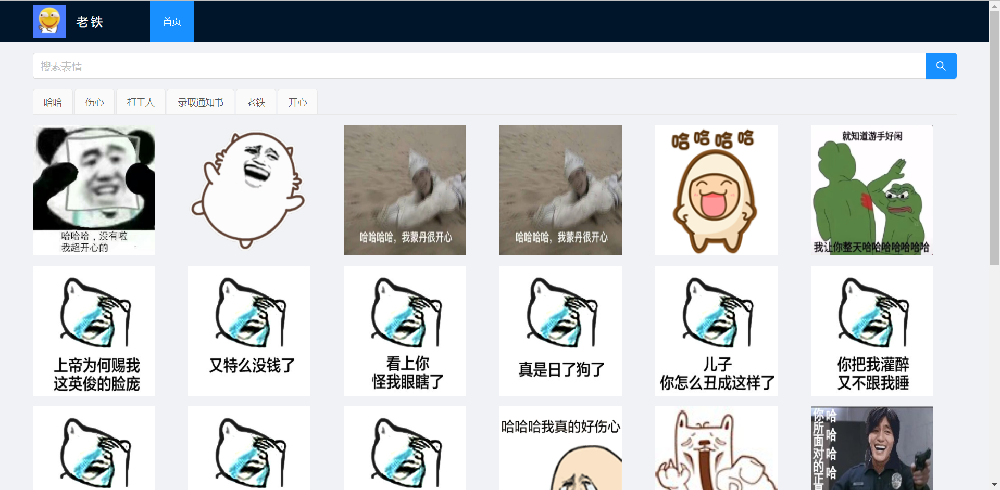

<h1 align="center">老铁</h1>

    

        专业的表情包网站
    

    

        搜表情，找老铁
    

---

Bug 很多，越修越多~

ʕ•̫͡•ʔ-̫͡-ʕ•͓͡•ʕ•̫͡•ʔ-̫͡-ʕ•͓͡•ʔ-̫͡-ʔ

## ⌚计划安排

| 日期          | 任务                   |
| ------------- | ---------------------- |
| 2022年2月28号 | 需求分析，技术选型     |
| 2022年3月1号  | 【后端】关键字模块开发 |
| 2022年3月2号  | 【后端】表情模块开发   |
| 2022年3月3号  | 【后端】统一返回结果   |
| 2022年3月4号  | 【后端】全局异常处理   |
| 2022年3月5号  | 【后端】爬虫模块开发   |
| 2022年3月6号  | 【后端】接口测试       |
| 2022年3月7号  | 【前端】主页开发       |
| 2022年3月8号  | 【前端】封装请求       |
| 2022年3月9号  | 【前端】热搜功能开发   |
| 2022年3月10号 | 【前端】搜索功能开发   |
| 2022年3月11号 | 前后端联调             |
| 2022年3月12号 | 项目部署上线           |
| 2022年3月13号 | 项目总结               |

## 🔧技术栈

前端

- 框架：Vue
- 组件库：Ant Design of Vue
- 请求：Axios
- 路由：Vue Router

后端

- Java 8
- 开发框架：SpringBoot 2.x
- 数据访问：Spring Data MongoDB
- 项目管理：Maven
- 接口管理：Apifox

## 🤝 欢迎贡献

对于一些 Bug 修复和细节优化，欢迎直接提交 PR 🌹

## 🔗参考资料

[https://github.com/liyupi/father](https://github.com/liyupi/father)

[https://spring.io/projects/spring-data-mongodb](https://spring.io/projects/spring-data-mongodb)

